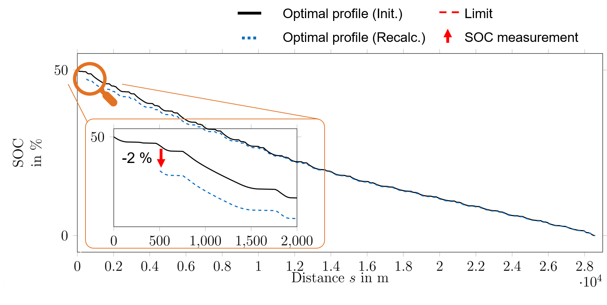

# Introduction

The repository `embes` (embedded energy strategy) contains an algorithm to calculate an energy strategy for an
all-electric race car in real time.  The algorithm is based on the [acados](https://docs.acados.org/) modeling language and interfaces [HPIPM](https://www.syscop.de/research/software/hpipm) to solve the internal Quadratic Problems. The package was developed by
and to power the race vehicle of the [Technical University of Munich](https://www.mw.tum.de/en/ftm/main-research/vehicle-dynamics-and-control-systems/roborace-autonomous-motorsport/) in the [Roborace](https://roborace.com/) competition.

The algorithm takes into account the constraining equations describing
- the driving dynamics,
- the thermodynamics,
- the battery SOC.

It minimizes the race time, i.e., it solves a Minimum Race Time Problem (MRTP), for a given number of laps.
This repo contains the necessary code to run the online energy strategy optimization.

# Functionality

Basically, the embedded energy strategy algorithm is divided into **three main steps**. These are the calculation of a velocity reference profile, the energy strategy initialization and the online recalculation.

### Reference velocity profile

The reference velocity profile is necessary to have an initial guess for the velocity state during
initialization of the energy strategy. The reference velocity could be driven by a combustion-engine-powered
vehicle, since it is only constrained by the driving dynamics:

### Initialization of the energy strategy

Before the race starts, we calculate an initial energy strategy. In the following example, consisting of 12 race laps
on the [Monteblanco](https://www.google.com/maps/place/Circuito+Monteblanco/@37.3591185,-6.5711467,15z/data=!4m5!3m4!1s0x0:0x159b1585543f1b3a!8m2!3d37.3591185!4d-6.5711467) race circuit, the machine temperature and the
battery SOC reach their technical limits when crossing the finish line:

#### Optimal velocity profile:

#### Corresponding machine temperature:

#### And battery SOC:

### Recalculation of the energy strategy

During the race, the energy strategy must be recalculated to account for disturbances or modeling uncertainties. In
the following example, we measure the machine temperature and the battery SOC after `500 m` of traveled distance.

The machine temperature is `3 °C` higher compared to our previous plan. The recalculated, optimal energy strategy
starts from this measurement value:

Additionally, the battery SOC is `2 %` lower compared to the initial plan. The recalculated, optimal energy
strategy starts from this measurement value:

The new plan for the remaining race, stating from `s = 500 m`, looks like the following:

# Documentation

A more detailed documentation can be found here: [Click this link to go to the documentation page](https://embes.readthedocs.io/en/latest/introduction.html).

### Disclaimer

This software is provided as-is and has not been subject to a certified safety validation. Autonomous Driving is a highly complex and dangerous task. In case you plan to use this software on a vehicle, it is by all means required that you assess the overall safety of your project as a whole. By no means is this software a replacement for a valid safety-concept. See the license for more details.

### Publication

The accepted version of the corresponding scientific paper will soon be available on [SAE Mobilus](https://saemobilus.sae.org/content/v127-12ej/).
