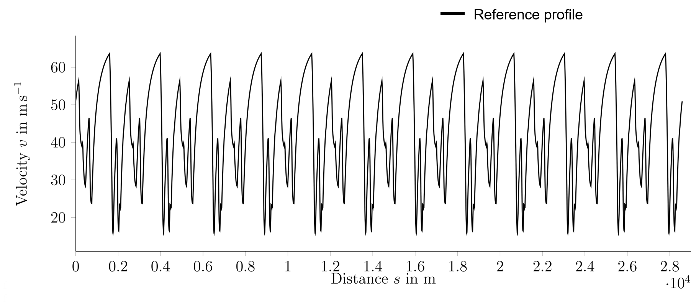
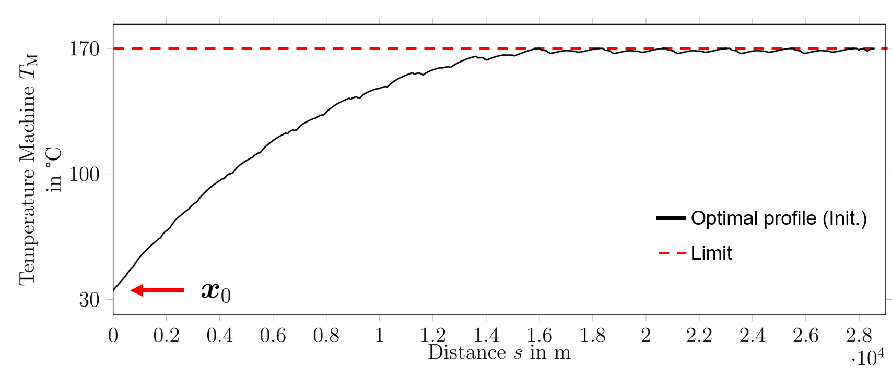

.. _refFunctionality:

Functionality
=============

This section explains the basic funcitonality of the enrgy strategy algorithm. It covers **three main steps**, which
must be executed in a row to get the algorithm up and working. The three steps cover the

    * **reference velocity profile**,
    * **initialization of the energy strategy**,
    * **recalculation of the energy strategy**.

Reference velocity profile
--------------------------

At first, we need a reference velocity profile for the entire race. This profile would be time-optimal if no
thermodynamic or energetic constraints were present. By this, only the driving dynamics are constraining the
optimization problem. We will later use the reference velocity profile as an initial state guess for the actual
energy strategy. A reference velocity profile for a race consisting of 12 laps on the `Monteblanco <https://www.google
.com/maps/place/Circuito+Monteblanco/@37.3591185,-6.5711467,15z/data=!4m5!3m4!1s0x0:0x159b1585543f1b3a!8m2!3d37
.3591185!4d-6.5711467>`_ race circuit could look like in the following figure:

Here, you can find a code example to :ref:`refStep1`.

Initialization of the energy strategy
-------------------------------------

Just before the race starts, we wish to initialize the energy strategy. The powertrain states (temperature and
available energy) are measured. These information are then used to find the time-optimal velocity profile and its
corresponding power:

.. image:: v_init.PNG
   :scale: 50
   :align: center

The optimal velocity profile differs from the reference velocity profile, since the temperature of the electric
machine and the battery SOC limit a full-speed operation, as can be seen here:

.. image:: SOC_init.PNG
   :scale: 50
   :align: center

Here, you can find a code example to the :ref:`refStep2`.

Reoptimization of the energy strategy
-------------------------------------

During the race, a recalculation of the energy strategy is required. Reasons for a recalculation can be model errors,
disturbances or unforeseen events, like, e.g., overtaking maneuvers. In the following, the recalculation is
triggered directly after an overtaking maneuver (`500 m` distance after the race start). Therefore, the machine
temperature is `3 °C` higher and the SOC `2 %` less, compared to the initial plan.

The following figures show the new temperature and SOC courses, predicted by the recalculated energy strategy:

.. image:: Temp_recalc.PNG
   :scale: 50
   :align: center

.. image:: SOC_recalc.PNG
   :scale: 50
   :align: center

The new velocity and power profiles, starting from the recalculation point (`500 m`), can be seen here:

.. image:: vel_recalc.PNG
   :scale: 50
   :align: center

Here, you can find a code example to the :ref:`refStep3`.
