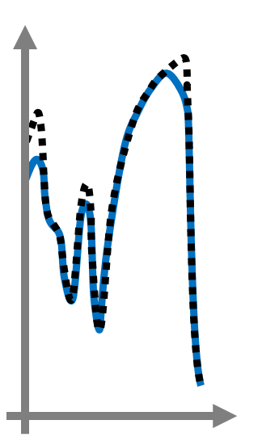

Introduction
============

``embes`` (embedded energy strategy) is a repository containing an algorithm to calculate an energy strategy for an
all-electric
race car. The algorithm is based on the `acados <https://docs.acados.org/>`_ modeling language and interfaces `HPIPM
<https://www.syscop.de/research/software/hpipm>`_ to solve the internal Quadratic Problems. The package was developed by
and to power the race vehicle of the `Technical University of Munich <https://www.mw.tum
.de/en/ftm/main-research/vehicle-dynamics-and-control-systems/roborace-autonomous-motorsport/>`_ in the `Roborace
<https://roborace.com/>`_ competition.

If you directly want to dive into the functionality behind this algorithm, check out the section
:ref:`refFunctionality`.

The algorithm takes into account the constraining equations describing

    * the driving dynamics,
    * the thermodynamics,
    * the battery SOC.

It minimizes the race time, i.e., it solves a Minimum Race Time Problem (MRTP), for a given number of laps. For
mathematical details, see :ref:`refProblemFormulation`.

For a quick start, check out the :ref:`refInstallation` and the :ref:`refExamples`-section in this manual.
